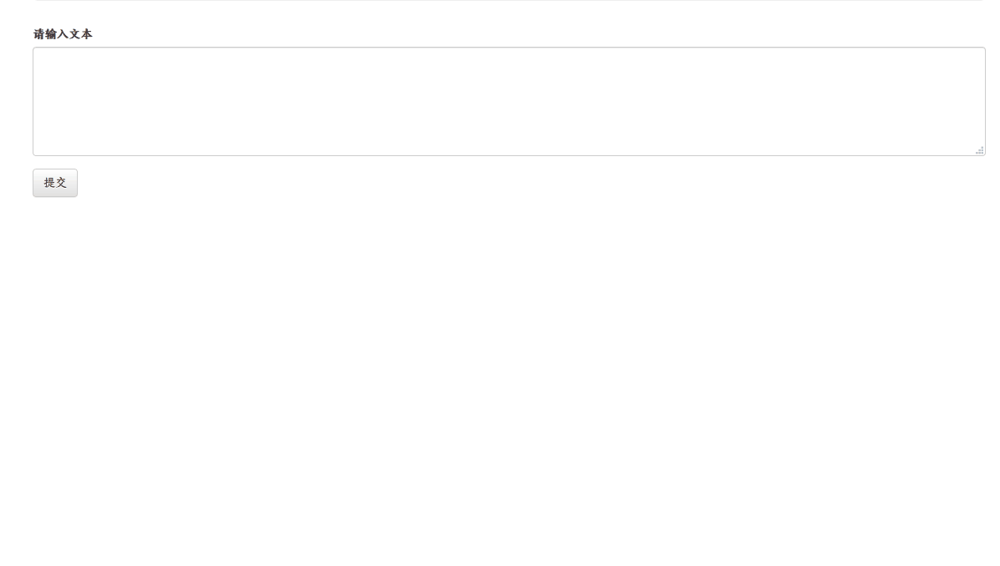
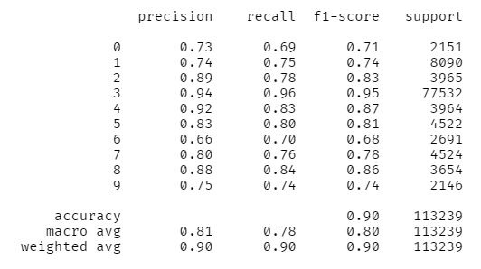
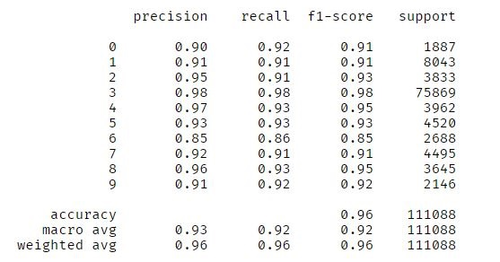
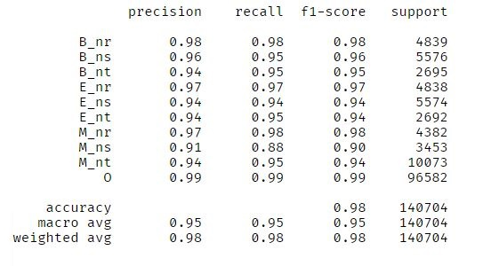

# 中文命名实体识别
基于同样的语料（[人民日报](https://github.com/buppt/ChineseNER/blob/master/data/renMinRiBao) ），分别训练了HMM、BiLSTM+CRF及基于ALBERT的多分类模型，运行如下图所示：    



## 数据
实体类型：人名(nr)、地名(ns)、机构名(nt)、其它(o)

每个实体中字符按其位置，进行标记：（B | 词首），（M | 词中），（E | 词尾），因此数据标签共十种

## 训练模型
参见 [notebooks](./notebooks)

## 模型：
- HMM
- BiLSTM-CRF
- ALBERT（预训练模型来源：https://github.com/brightmart/albert_zh）

训练完成的模型：[百度网盘链接](https://pan.baidu.com/s/1lIVomat3AAff7HfFzfpRxQ) 提取码：xsdl
将模型文件保存在项目的 `ner/saved` 文件夹中

## 性能
- HMM



- BiLSTM-CRF



- ALBERT



## 运行：
```shell
> cd ner
> python app.py
```
